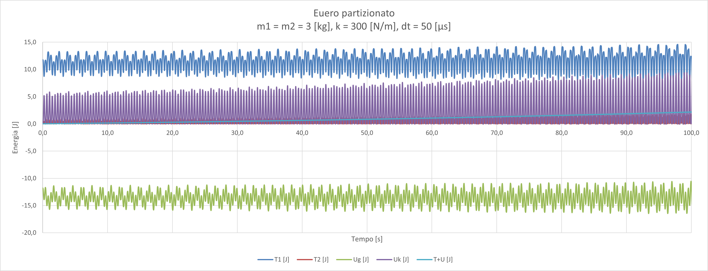
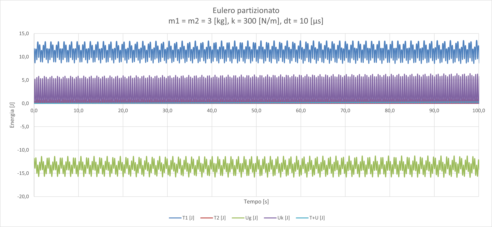
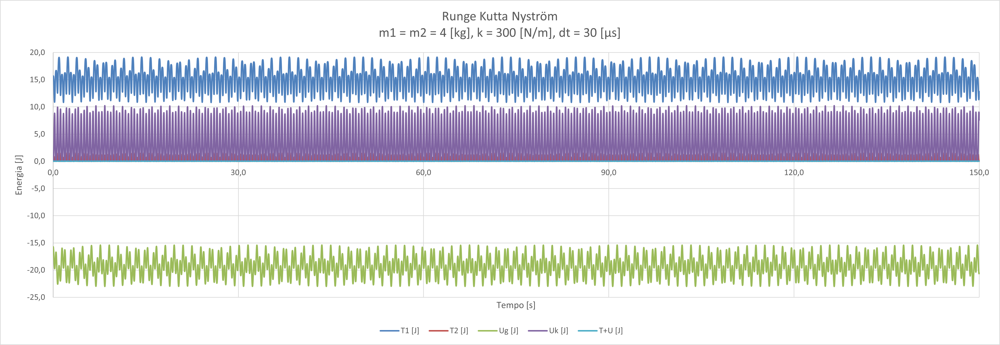
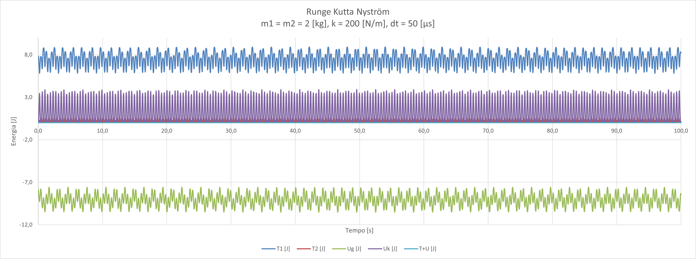
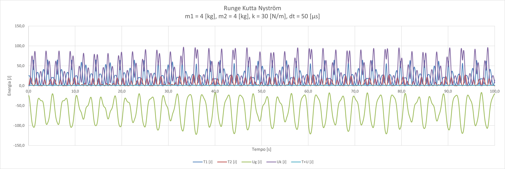
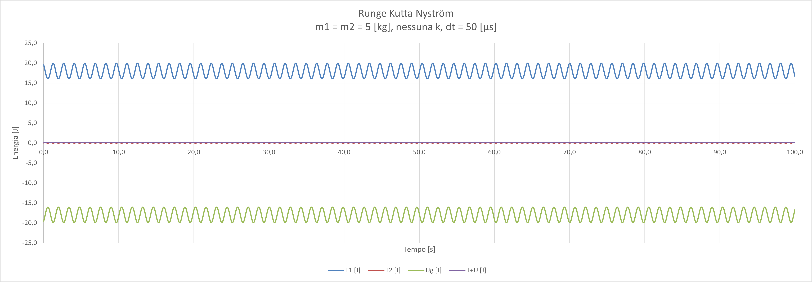

# Esempi di Export
Qui troverai esempi di export sia per il metodo [Runge Kutta Nyström](#runge-kutta-nyström) sia per il metodo di [Eulero partizionato](#eulero-partizionato).

## Eulero Partizionato
Export scaricabili:
- [euler/default-values.xlsx](./euler/default-values.xlsx)
- [euler/default-values-small-dt.xlsx](./euler/default-values-small-dt.xlsx)
- [euler/no-spring.xlsx](./euler/no-spring.xlsx)

## Runge Kutta Nyström
Export scaricabili:
- [rkn/normal-spring-lower-dt.xlsx](./rkn/normal-spring-lower-dt.xlsx)
- [rkn/medium-spring.xlsx](./rkn/medium-spring.xlsx)
- [rkn/soft-spring.xlsx](./rkn/soft-spring.xlsx)
- [rkn/no-spring.xlsx](./rkn/no-spring.xlsx)

